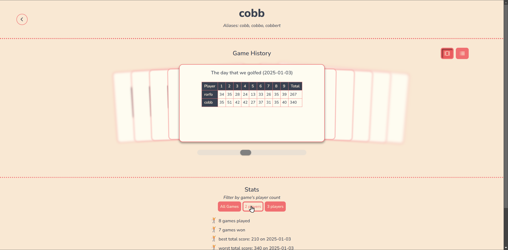

# Gawlf

A turn-based multiplayer game to play online with friends, based on the classic playing card game Golf.

## Play the Game

🎮 Visit the live site and create a lobby to play with at least one friend: [Gawlf](https://gawlf.fly.dev)

## Features

- Play with 2 to 8 players in real-time.
- Selection of backgrounds and card-back designs to customize experience.
- Profiles that display past game records and unique player stats.
- Supports desktop and mobile browsers.




## Technologies

- Frontend: React, Vite
- Backend: Rails
- Deployment: Fly.io

## For Developers

If you'd like to explore or contribute to the codebase, you can set up the project locally by following these steps:

### Prerequisites

Make sure you have the following installed:

- **Ruby** (with Bundler)
- **Node.js** and **npm**
- **PostgreSQL** (or the database you're using)
- **Rails**

---

### Getting Started

1. **Clone the repository:**

```
 git clone https://github.com/maybethee/gawlf.git
 cd gawlf
```

3. **Set up the backend:**

- Install ruby gems:
  ```
  bundle install
  ```
- Set up the database:
  ```
  rails db:create db:migrate
  ```
- Start the Rails server:
  ```
  rails s
  ```
- By default, the backend will run on `http://localhost:3000`

3. **Set up the frontend:**

- Navigate to the React app folder inside the rails app:
  ```
  cd gawlf-fe
  ```
- Install npm dependencies:
  ```
  npm install
  ```
- Start the development server:
  ```
  npm run dev
  ```
- By default, the frontend will run on `http:/localhost:5173`

4. **Access the app**: Open your browser and navigate to `localhost:5173`. The frontend will communicate with the backend on `http://localhost:3000`.

### Notes

- **Hot Reloading**: Changes in the React app will be reflected in real time, but backend changes will require you to restart the Rails server.

---

## Contributing

Feel free to open an issue or submit a pull request if you encounter any problems or have ideas for improvements!

## License

This project is licensed under the [Creative Commons Attribution-NonCommercial 4.0 International License](LICENSE).
